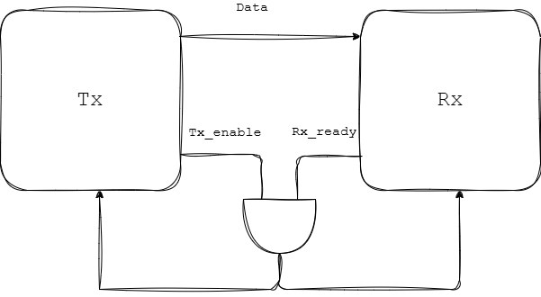

# COCOTB
- cocotb is COroutine based COsimulation TestBench environment for verifying VHDL and SystemVerilog RTL using Python.

## Interface 

- Data transfer takes place from Data Producer (Tx) to Data Consumer (Rx)
- The Tx and Rx might be operating at different speeds i.e the speed in which the data is produced might not be equal to the speed at which the data can be received. Therefore the ready and enable signals of the Tx and Rx are and-ed(A.B) form the enable signals to the two FFs.
- The above mentioned scheme is one of the signalling scheme to ensure that data transfer takes place.

## Verification Theory
- As the size of the circuit or design increases its impossible to test it against every possible input combination.
- Therefore either Directed Tests or Random Tests are perfromed.
- Directed Tests : Select a subset of vectors most likely to catch a bug(Min,Max,walking one, walking zero,alterante one and zeros etc).
- Random Tests : Select a random subset of vector to increase the likelyhood of hitting unexpected scenario.

| Parameter | Directed tests | Random tests |
| :---------| :-------------:| ------------:|
| Effort for test environment | Less | More|
| Effort for test case | More | Less |
|Simulation time| Less | More |
| Hits known corner cases | Yes | No |
| Hits unknown corner cases | No | Yes | 

### Approach 
- Therefore directed tests are used for inital bringup.
- Randomization for regression testing
- Code and Functional coverage for signoff.
### Metrics for verification
- Code coverage ensure every line of the code is executed atleast once (i.e. every if else case or case statement is verified this includes branch coverage, toggle coverage, FSM Coverage etc), functional coverage ensures all functional cases mentioned in the design/architecture/protocol document are verified to ensure correctness either using assertions or coverage bin.
- Code Coverage: Measured by simulator
    - Statement/line/block coverage
    - Branch coverage
    - Toggle coverage
- Functional Coverage: Defined by test env writer
    - Bins
    - Cross Coverage


## Additional 
- ReadOnly() - It is a simualtion scheduling trigger that ensures the signals are read only after all the RTL events have occured in the current timestep.
``` bash 
for _ in range(5):
    await RisingEdge(dut.clk)
    await ReadOnly()
    count = dut.count.value.integer
    cocotb.log.info(f"The value of count is {count}")
```

- with_timeout() - The max time I'm willing to wait for a signal/event. Max wait time (deadline)
``` await with_timeout(RisingEdge(dut.clk),100,'ns') ```
Indicates your willing to wait for a rising_edge(clk) if it occurs within the 100 ns else it throws a 
```SimTimeoutError ```


